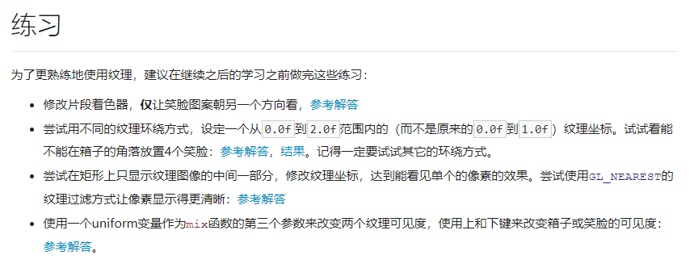
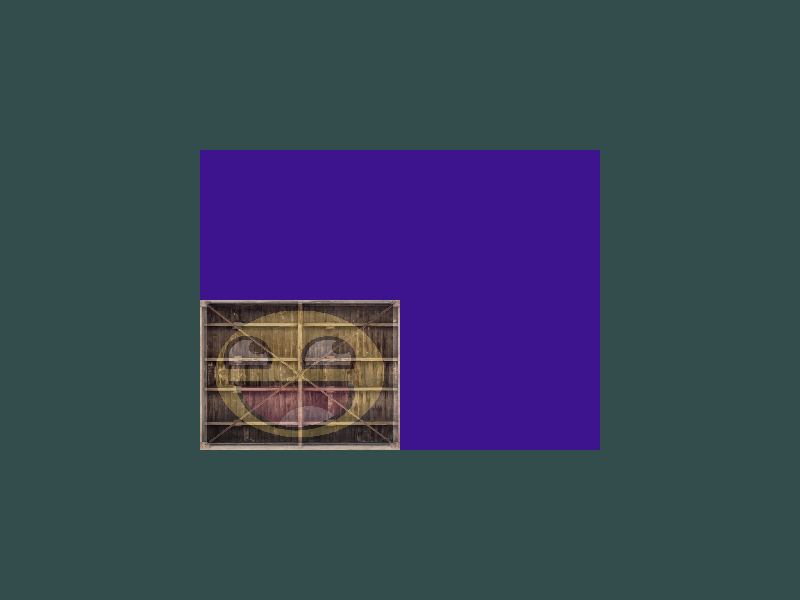
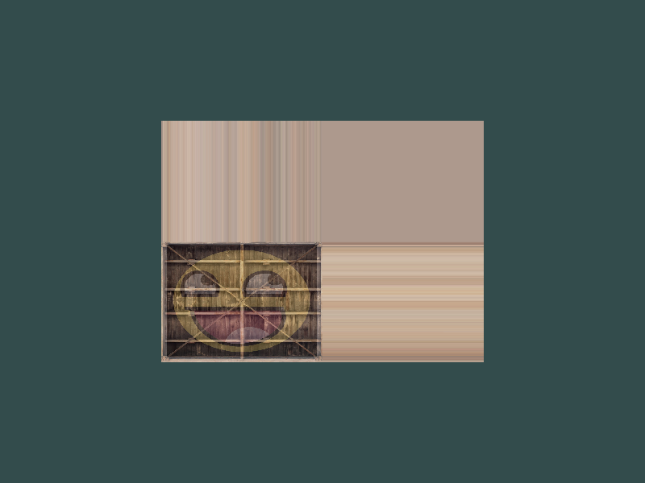
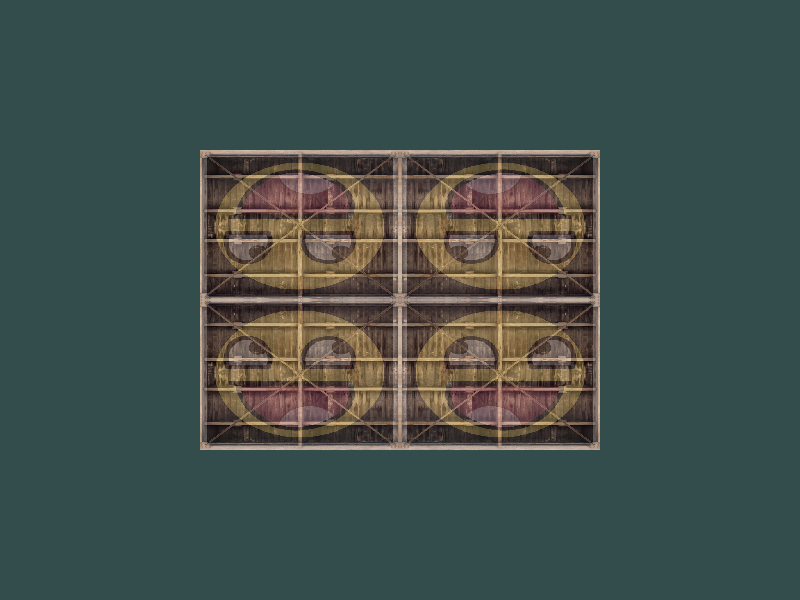
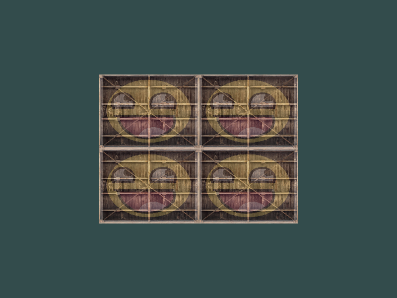
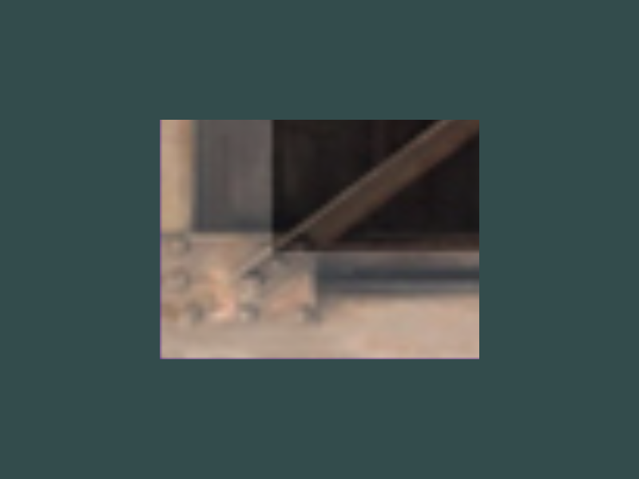

## 纹理 练习



- 修改笑脸朝向

  ```glsl
  // fragment glsl
  FragColor = mix(texture(texture1, TexCoord), texture(texture2, vec2(1 - TexCoord.x, TextCoord.y)), 0.2);
  ```
  
- 尝试不同的环绕方式

- `GL_CLAMP_TO_BORDER`环绕方式

  

- `GL_CLAMP_TO_EDGE`环绕方式

  

- `GL_MIRRORED_REPEAT`环绕方式

  

- `GL_REPEAT`环绕方式

  

- 使用`GL_NEAREST`过滤方式

  

- 使用`GL_LINEAR`过滤方式

  
  
- 设定范围纹理坐标0.0-2.0
  ```glsl
  // vertex glsl
  // main函数中：
  TexCoord = aTexCoord * 2.0f;
  ```

- 图像居中
  ```glsl
  // vertex glsl
  // main函数中：
  TexCoord = aTexCoord - 0.5f;
  ```

- 显示纹理图像的一部分，只需要将纹理坐标缩小
  ```glsl
  // vertex glsl
  // fragment glsl的main函数中：
  TexCoord = aTexCoord * 0.1f;
  ```
- 使用一个`uniform`变量作为`mix`函数的第三个参数来改变两个纹理可见度

  ```glsl
  // fragment glsl
    uniform float factor;   //用于按键改变mix的第三个参数（混合度）
      //main函数中：
    FragColor = mix(texture(texture1, TexCoord), texture(texture2, TexCoord), abs(sin(factor * 0.2)));
  //main.cpp中：
      //main函数外：
    float factor = 0.0;    //用于按键变化纹理混合度
      //main函数中
    factor = glfwGetTime();                    // 获取当前时间
    ourShader.setFloat("factor", factor);     // 设置uniform变量
  ```

  